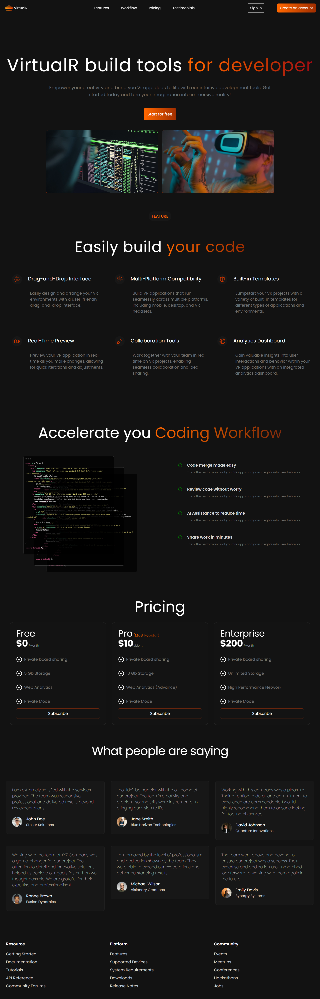

# VirtualR --- which contain several component that used in future for development

# live link: https://virtualr-landing-page-munna.netlify.app/

--it containt: 
- Responsive navBar with mobile menu and fully responsive |log ------ links ------ signin,create account/menu|

